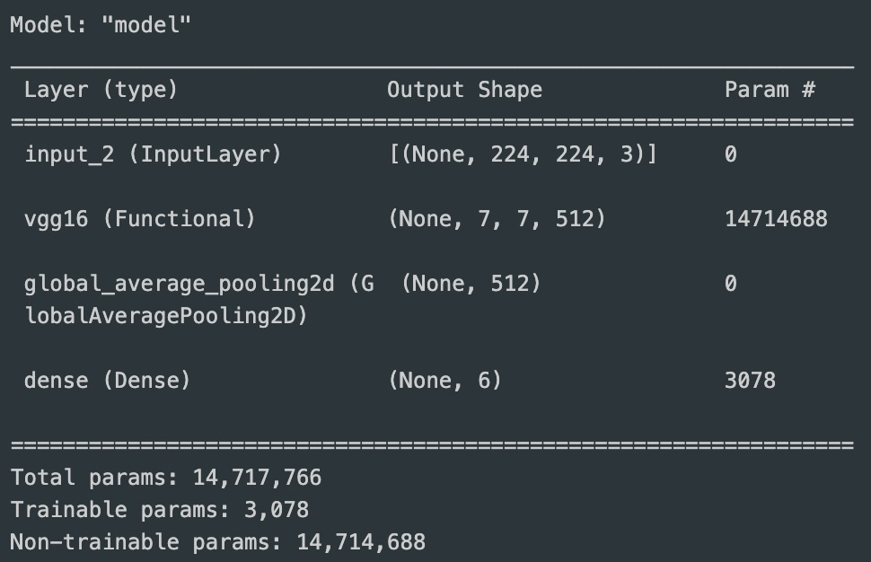
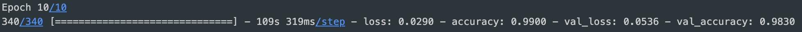
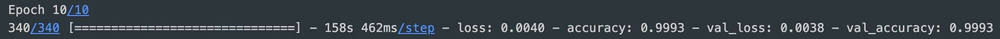
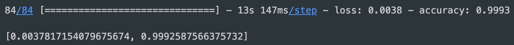
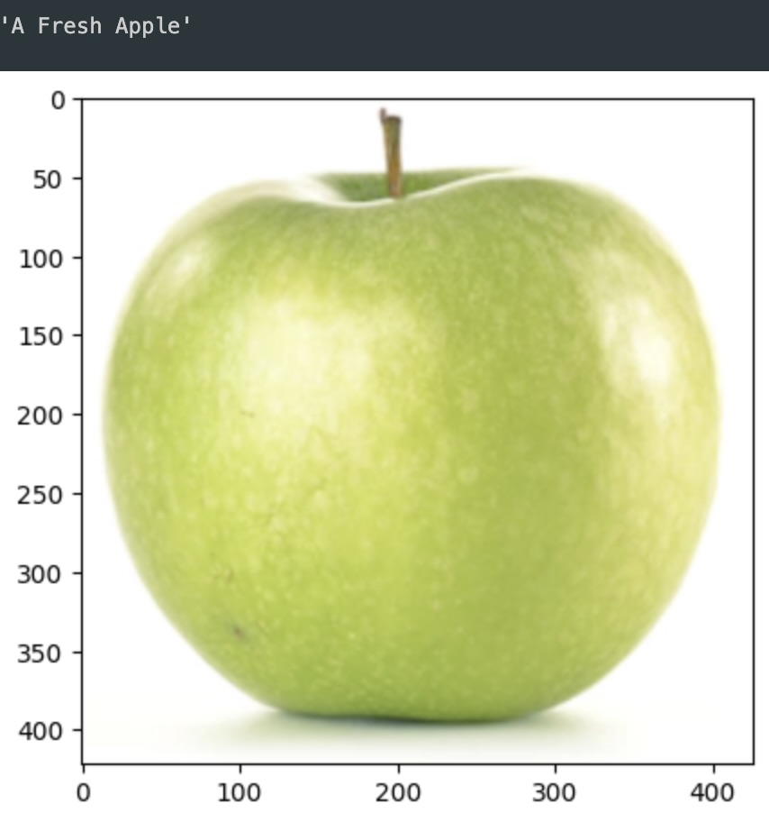
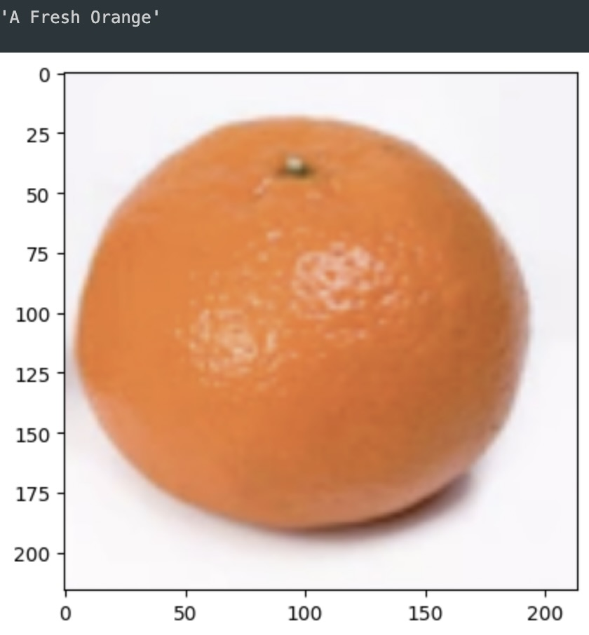
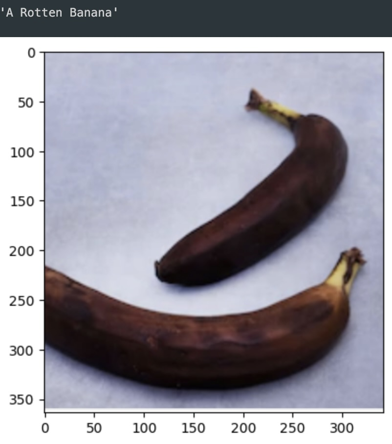

# Fruit Classification

Convolutional Neural Network (CNN) that classifies 6 categories of fruit. This model uses transfer learning with the VGG16 model provided by the Keras library and datasets provided by Kaggle. The model classifies apples, bananas, and oranges based on whether they are fresh or rotten. Model is saved and loaded for evaluation without retraining or usage elsewhere.

---

## Technologies

This project leverages Python with the following packages:

* [Tensorflow](https://www.tensorflow.org/) - For Keras, VGG16, model work, image processing, data generation, training and evaluation.

* [Matplotlib](https://matplotlib.org/) - For plt and mping to display images.

* [Numpy](https://numpy.org/) - For argmax to assist in model evaluation.

This project also uses datasets from Kaggle.

---

## Installation Guide

Before first running the application, install the following dependencies:

```python
    pip install tensorflow
    pip install numpy
    pip install matplotlib
```

Jupyter may be required to view the .ipynb file.

```python
    pip install jupyter
```

The Kaggle dataset must also be downloaded and placed in the project directory if the user wishes to retrain the model or evaluate with the images included. The dataset can be directly downloaded from the link in the technologies section or the Kaggle API. The model is saved and loaded for evaluation and can be used to evaluate other images without downloading the dataset.

The Kaggle dataset used can be downloaded [Here](https://www.kaggle.com/datasets/sriramr/fruits-fresh-and-rotten-for-classification).

Due to GitHub filesize limitations, the saved model is stored on Google Drive and can be found [Here](https://drive.google.com/drive/folders/1RMwdAdWB5OKl-tyhW3ujGs-RbhgaNaLp?usp=sharing). To evaluate the model without retraining, download the fruit_cnn file and place it in the repository.

---

## Usage


---

## Analysis

#### Overview of the model:



Model has 

#### Results of first model training using augmented Kaggle dataset:















---

## Contributors

Brought to you by Majid Kouki. You can reach me at [majidkpy@gmail.com](mailto:majidkpy@gmail.com).

---

## License

[](https://opensource.org/licenses/MIT)