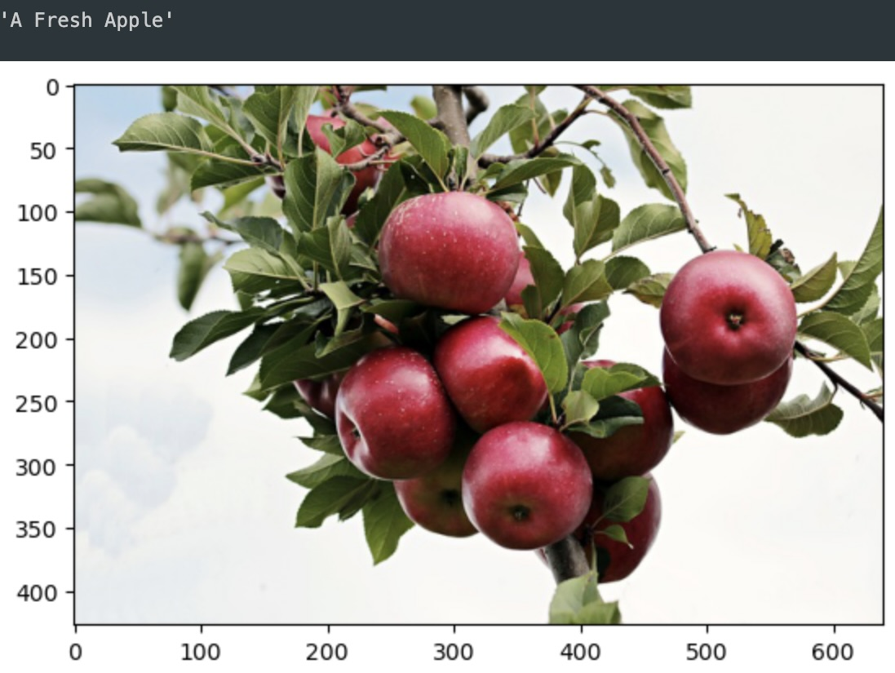
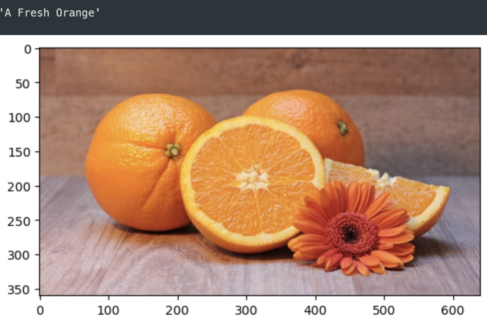
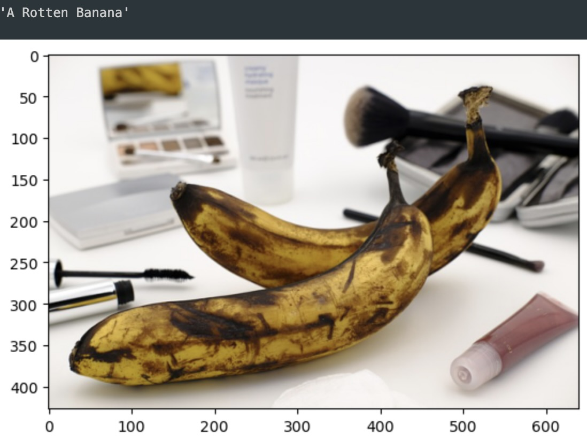

# Fruit Classification

Convolutional Neural Network (CNN) that classifies 6 categories of fruit and displays the image alongside the prediction. This model uses transfer learning with the VGG16 model, provided by the Keras library, and data provided by Kaggle and Pixabay. The model classifies apples, bananas, and oranges based on whether they are fresh or rotten. Model is saved and loaded to Google Drive (due to filesize) for evaluation without retraining or usage elsewhere.

---

## Technologies

This project leverages Python with the following packages:

* [Tensorflow](https://www.tensorflow.org/) - For Keras, VGG16, model work, image processing, data generation, training and evaluation.

* [Matplotlib](https://matplotlib.org/) - For plt and mping to display images.

* [Numpy](https://numpy.org/) - For argmax to assist in model evaluation.

This project also uses datasets from [Kaggle](https://www.kaggle.com/) and individual data from [Pixabay](https://pixabay.com/).

---

## Installation Guide

Before first running the application, install the following dependencies:

```python
    pip install tensorflow
    pip install numpy
    pip install matplotlib
```

Jupyter may be required to view the .ipynb file.

```python
    pip install jupyter
```

The Kaggle dataset must also be downloaded and placed in the project directory if the user wishes to retrain the model or evaluate with the images included. The Kaggle dataset used can be downloaded [Here](https://www.kaggle.com/datasets/sriramr/fruits-fresh-and-rotten-for-classification) or via the Kaggle API. The model is saved and loaded in the project and the files for it can be found [Here](https://drive.google.com/drive/folders/1RMwdAdWB5OKl-tyhW3ujGs-RbhgaNaLp?usp=sharing). Model is uploaded seperately due to GitHub filesize limits. Place Kaggle dataset folder and fruit_cnn model folder in project directory to use.

---

## Usage

This project is primarily intended for analysis and model creation. The project can be modified to accommodate new data and be used to train a different model. The ideal usage of this project is to download and use the model for testing with new images that fit the classification it's built for or to use the model elsewhere. 

---

## Analysis

### Overview of the model:


The model has 14,714,688 parameters from VGG16 that are frozen until the fine-tuning stage. 3,078 parameters are added to the VGG16 model to train it for this particular classification problem. The output layer is set to 6 for the 6 objects the model will classify (fresh apples, bananas, oranges and rotten apples, bananas, and oranges).

--- 

### Results of first model training using augmented Kaggle dataset:


The model reached 99% accuracy with training data and 98.3% accuracy with testing data and minimal loss all around. These numbers are good, but not good enough which leads to the next stage: fine-tuning. The base VGG16 model is unfrozen and set to a very low learning rate (.00001) in order to further increase accuracy and decrease loss.

---

### Results of second model training using fine-tuned model and augmented Kaggle dataset:


After fine-tuning, the model reached an accuracy of 99.93% with both training and testing data and a loss below 1% for both.

---

### Results of model evaluation:


Evaluating the model confirms the 99.93% accuracy and loss below 1%. Below are images predicted by the model with their results above. predict_fruit function was defined to easily display the image, predict it with model, and then display the prediction in a readable format for the user. Examples of evaluating the testing data are shown below:


The model was then tested on additional images found on [Pixabay](https://pixabay.com/) to evaluate accuracy with more real world examples. The results shown below:





---

### Next steps:

The ideal next steps to further develop this model would likely be a more diverse dataset as well as modifications to the layers, particularly the output. The goal of this would be to 1. Provide enough data to allow classification of more than 6 categories (more fruits and more variations) and 2. Train the model to identify fruit with more diverse images that have multiple fruits, complex backgrounds, and more. This would result in a model capable of identifying more fruit in more scenarios, resulting in a more practically useful model.

---

## Contributors

Brought to you by Majid Kouki. You can reach me at [majidkpy@gmail.com](mailto:majidkpy@gmail.com).

---

## License

[](https://opensource.org/licenses/MIT)